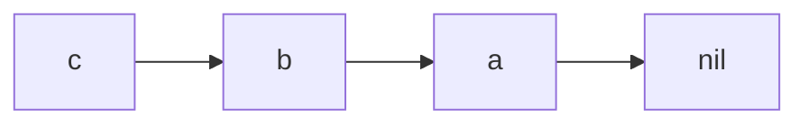
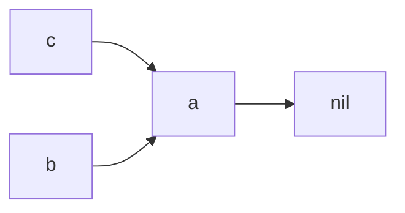

# rust智能指针

## Rc 引用计数

在rust中，如果你想设计一个链表，是离不开指针的，在其他语言中也差不多。

你可以使用Box来构建链表。如下
```rust
enum List {
    Cons(i32, Box<List>),
    Nil,
}

use List::{Cons, Nil};
fn list_with_box() {
    let a = Cons(5, Box::new(Nil));
    let b= Cons(4, Box::new(a));
    let c= Cons(3, Box::new(b));
}
```
但是这仅限于单链表。如果是下面的结构，便会因为**所有权**规则报错。


以golang为例，我们都会习惯性的让c的next指向a就行了，如下
```rust
enum List {
    Cons(i32, Box<List>),
    Nil,
}

use List::{Cons, Nil};
fn list_with_box() {
    let a = Cons(5, Box::new(Nil));
    let b= Cons(3, Box::new(a));
    let c= Cons(4, Box::new(a));
}
```
但这会报错，因为a的所有权只有一个，并且已经转移给了b的next。
> use of moved value: `a` value used here after move
move occurs because `a` has type `List`, which does not implement the `Copy` trait

### 多个所有权 Rc

一个所有权不够用那就多个吗，还能怎么办。Rc，全称 refrence counting，即**引用计数**，这就很熟悉了，Rc会跟踪某个值的引用次数以确定该值是否仍在使用中。（其实这也是一种**垃圾回收**算法）。代码更新如下。

```rust
enum List {
    Cons(i32, Rc<List>),
    Nil,
}

use std::rc::Rc;

use List::{Cons, Nil};
fn list_with_box() {
    let a = Rc::new(Cons(5, Rc::new(Nil)));
    let b = Cons(3, Rc::clone(&a));
    let c = Cons(4, Rc::clone(&a));
}
```

当然了，rust也提供了查看引用计数个数的方法，当创建的引用离开作用域的时候，对应的引用计数也会减一。

```rust

enum List {
    Cons(i32, Rc<List>),
    Nil,
}

use std::rc::Rc;

use List::{Cons, Nil};
fn list_with_box() {
    let a = Rc::new(Cons(5, Rc::new(Cons(10, Rc::new(Nil)))));
    println!("count after creating a = {}", Rc::strong_count(&a));
    let b = Cons(3, Rc::clone(&a));
    println!("count after creating b = {}", Rc::strong_count(&a));
    {
        let c = Cons(4, Rc::clone(&a));
        println!("count after creating c = {}", Rc::strong_count(&a));
    }
    println!("count after c goes out of scope = {}", Rc::strong_count(&a));
}

#[cfg(test)]
mod test {
    use super::list_with_box;


    #[test]
    fn test_list_with_box() {
        list_with_box()
    }
}
```
> count after creating a = 1
count after creating b = 2
count after creating c = 3
count after c goes out of scope = 2
test smart_pointer::rc::test::test_list_with_box ... ok

**但是现在又有一个问题**我们想修改链表的节点要怎么办。

## RefCell 内部可变性

简单来说就是即使存在对该数据的不可变引用，也允许你更改数据。**要知道，可变引用与不可变引用是没法共存的**，RefCell却允许这样操作，不过也只是在编译阶段没做所有权检查而已，在运行阶段还是会检查所有权的。

先来一段简单的代码，我们并没有声明v是可变的，但v的值修改了
```rust
fn data_rc() {
    let v = RefCell::new(5);
    println!("data before {:?}", v.borrow());

    *v.borrow_mut() += 2;

    println!("data after {:?}", v.borrow());
}

#[cfg(test)]
mod test {
    use super::data_rc;

    #[test]
    fn test_data_rc() {
        data_rc()
    }
}
```
执行结果如下
>data before 5
data after 7

接下来修改代码，然后执行，这时候会报错，不过如果你主动drop掉v_borrow_mut，又可以执行了。所以rust编译器还是坚守**可变引用与不可变引用是没法共存**的，只不过不在编译阶段做检查罢了。
```rust
fn data_rc() {
    let v = RefCell::new(5);
    println!("data before {:?}", v.borrow());

    let mut v_borrow_mut = v.borrow_mut();
    *v_borrow_mut += 2;
    
    // drop(v_borrow_mut);

    println!("data after {:?}", v.borrow());
}

#[cfg(test)]
mod test {
    use super::data_rc;

    #[test]
    fn test_data_rc() {
        data_rc()
    }
}
```

>data before 5
thread 'smart_pointer::refcell1::test::test_data_rc' panicked at src/smart_pointer/refcell1.rs:19:35:
already mutably borrowed: BorrowError

### Rc<RefCell<T>>

通过组合 Rc 和 RefCell 拥有可变数据的多个所有权。结合之前提到的链表，如果我们修改节点a的value，那么节点b和节点c的next的value应该都同步修改。

```rust
#[derive(Debug)]
enum List {
    Cons(Rc<RefCell<i32>>, Rc<List>),
    Nil,
}

use List::{Cons, Nil};

fn list_rc_refcell() {
    let value = Rc::new(RefCell::new(5));

    let a = Rc::new(Cons(Rc::clone(&value), Rc::new(Nil)));

    let b = Cons(Rc::new(RefCell::new(3)), Rc::clone(&a));
    let c = Cons(Rc::new(RefCell::new(4)), Rc::clone(&a));

    *value.borrow_mut() += 10;

    println!("a after = {:?}", a);
    println!("b after = {:?}", b);
    println!("c after = {:?}", c);
}

#[cfg(test)]
mod test {
    use super::*;

    #[test]

    #[test]
    fn test_list_rc_refcell() {
        list_rc_refcell()
    }
}
```
和预期一致。

>a after = Cons(RefCell { value: 15 }, Nil)
b after = Cons(RefCell { value: 3 }, Cons(RefCell { value: 15 }, Nil))
c after = Cons(RefCell { value: 4 }, Cons(RefCell { value: 15 }, Nil))

## 循环引用

还是以链表为例，之前我们修改的是节点的value，然而在大部分情况下我们想修改的是节点的next。